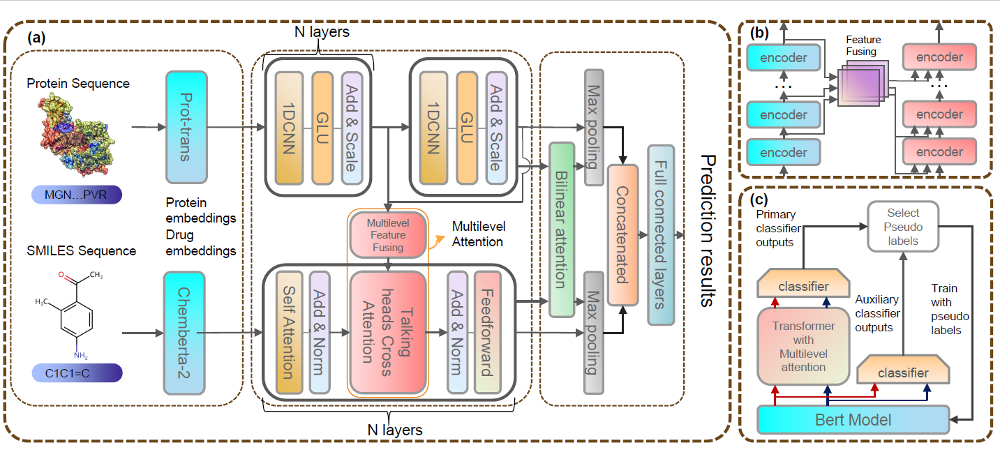

# Multilevel Attention Network with Semi-supervised Domain Adaptation for Drug-Target Prediction | [Paper](https://doi.org/10.1609/aaai.v38i1.27786)


## Introduction
This repository contains the PyTorch implementation of **MlanDTI** framework,
## Framework

## System Requirements
The source code developed in Python 3.8 using PyTorch 1.7.1. The required python dependencies are given below. MlanDTI is supported for any standard computer and operating system (Windows/macOS/Linux) with enough RAM to run. There is no additional non-standard hardware requirements.

```
torch>=1.7.1
numpy>=1.20.2
scikit-learn>=0.24.2
pandas>=1.2.4
rdkit~=2021.03.2
transformers~=4.24.0
argparse~=1.4.0
pandas~=1.5.1
tqdm~=4.65.0
```
## Installation Guide
```
# create a new conda environment
$ conda create --name mlandti python=3.8
$ conda activate mlan

# install requried python dependencies
$ conda install pytorch==1.7.1 torchvision==0.8.2 torchaudio==0.7.2 cudatoolkit=10.2 -c pytorch
$ conda install -c conda-forge rdkit==2021.03.2
$ pip install -U scikit-learn
$ conda install -c conda-forge transformers

```


## Datasets
The `datasets` folder contains all experimental data used in MlanDTI: [BindingDB](https://www.bindingdb.org/bind/index.jsp) [1], [BioSNAP](https://github.com/kexinhuang12345/MolTrans) [2] , [Human](https://github.com/lifanchen-simm/transformerCPI) [3] and [C.elegans](https://github.com/lifanchen-simm/transformerCPI) [3]. 
In all datasets folders, we have full data with two random and clustering-based splits for both in-domain and cross-domain experiments.


## Run MlanDTI on Our Data to Reproduce Results

To train MlanDTI, you should follow these steps:
1. Generate protein embeddings and smiles embeddings, run `get_embeddings.py` to generate embeddings for correspoding datasets.
2. For experiments with vanilla MlanDTI, you can directly run the following command. `${dataset}` could either be `bindingdb`, `biosnap` , `human` and `celegans`. `${split_task}` could be `cluster`,`random` and `cold`. 
```
$ python main.py --dataset ${dataset} --type ${split_task}
```
For the cross-domain experiments with MlanDTI+PL, you can directly run the following command. `${dataset}` could either be `bindingdb`, `biosnap` , `human` and `celegans`.
```
$ python main.py --data ${dataset} --type cluster --usepl True
```


## References
    [1] Liu, Tiqing, Yuhmei Lin, Xin Wen, Robert N. Jorissen, and Michael K. Gilson (2007). BindingDB: a web-accessible database of experimentally determined protein–ligand binding affinities. Nucleic acids research, 35(suppl_1), D198-D201.
    [2] Huang, Kexin, Cao Xiao, Lucas M. Glass, and Jimeng Sun (2021). MolTrans: Molecular Interaction Transformer for drug–target interaction prediction. Bioinformatics, 37(6), 830-836.
    [3] Chen, Lifan, et al (2020). TransformerCPI: improving compound–protein interaction prediction by sequence-based deep learning with self-attention mechanism and label reversal experiments. Bioinformatics, 36(16), 4406-4414.
    [4] Kim, Jin-Hwa, Jaehyun Jun, and Byoung-Tak Zhang (2018). Bilinear attention networks. Advances in neural information processing systems, 31.
    [5] Haiping Lu, Xianyuan Liu, Shuo Zhou, Robert Turner, Peizhen Bai, ... & Hao Xu (2022). PyKale: Knowledge-Aware Machine Learning from Multiple Sources in Python. In Proceedings of the 31st ACM International Conference on Information and Knowledge Management (CIKM).
